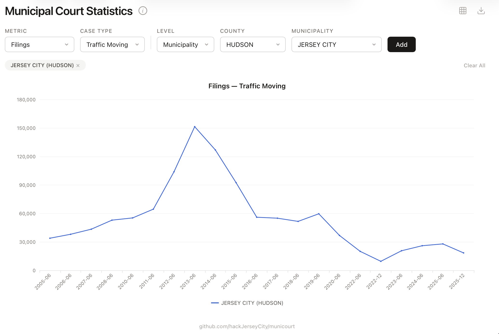

# municourt

A toolkit for extracting, exploring, and visualizing New Jersey Municipal Court Statistics. It parses the NJ Courts' annual PDF reports directly from content streams (no OCR), stores the results as JSON/CSV, and serves an interactive web dashboard for comparing trends across jurisdictions, metrics, and case types.

Live at [municourt.hackjc.org](https://municourt.hackjc.org).



## Quick start

```bash
go build -o municourt .

# Download all available PDFs from NJ Courts
municourt download -dir data/

# Parse every PDF into JSON + CSV
municourt parse data/

# Start the web dashboard
municourt web -dir data/
# → http://localhost:8080
```

## Commands

### `municourt download`

Scrapes [njcourts.gov/public/statistics](https://www.njcourts.gov/public/statistics) for municipal court PDF links and downloads them.

```
municourt download [-dir outputDir]
```

Files are saved as `municipal-courts-YYYY-MM.pdf`.

### `municourt parse`

Parses one or more PDFs into structured JSON and CSV.

```
municourt parse <input.pdf|directory> [--json out.json] [--csv out.csv]
```

When given a directory, every `.pdf` inside it is parsed. Output files are written alongside the input with the same base name unless overridden.

Includes interactive **deduplication**: when municipality names change between years (e.g. "TOWNSHIP" vs "TOWN" suffixes), the tool detects candidates that never co-occur in the same time period and prompts you to merge them.

### `municourt web`

Starts an HTTP server that serves the interactive dashboard and a JSON API.

```
municourt web [-dir data/] [-port 8080]
```

All parsed JSON files in the data directory are loaded into memory at startup. There is no database — the server reads `*.json` files and serves everything from RAM.

### `municourt viz`

Renders charts to the terminal (sparklines) or to a PDF file.

```
municourt viz [-dir data/] [-metric filings] [-type grand-total] [-pdf output.pdf]
```

## Web dashboard

The dashboard is a single-page app embedded in the Go binary. It provides:

- **Multi-entity comparison** — add any combination of state, county, and municipality-level series to the same chart.
- **Multi-metric/type selection** — each entity captures the metric and case type set at add-time, so you can plot Filings vs Clearance Rate or DWI vs Parking on the same chart.
- **Smart labeling** — chip and legend labels only show metric/type suffixes when those dimensions actually vary across the current selection, keeping things clean.
- **Dynamic chart title** — shows the shared metric/type when uniform, omits dimensions that are mixed.
- **Data table modal** — view the raw numbers in a sortable table and download as CSV.
- **Shareable URLs** — the full state (entities, metrics, types) is encoded in the URL for bookmarking and sharing. Old-format URLs with global metric/type params are handled for backwards compatibility.
- **Image export** — save the chart as a PNG.

## API

### `GET /api/metadata`

Returns the lists of counties, municipalities, metrics, and case types used to populate the UI dropdowns.

```json
{
  "counties": ["ATLANTIC", "BERGEN", ...],
  "municipalities": {
    "ATLANTIC": ["ABSECON", "ATLANTIC CITY", ...],
    ...
  },
  "metrics": [
    {"value": "filings", "label": "Filings"},
    {"value": "resolutions", "label": "Resolutions"},
    {"value": "clearance", "label": "Clearance"},
    {"value": "clearance-pct", "label": "Clearance %"},
    {"value": "backlog", "label": "Backlog"},
    {"value": "backlog-per-100", "label": "Backlog/100 Monthly Filings"},
    {"value": "backlog-pct", "label": "Backlog %"},
    {"value": "active-pending", "label": "Active Pending"}
  ],
  "types": [
    {"value": "grand-total", "label": "Grand Total"},
    {"value": "indictables", "label": "Indictables"},
    {"value": "dp-pdp", "label": "D.P. & P.D.P."},
    {"value": "other-criminal", "label": "Other Criminal"},
    {"value": "criminal-total", "label": "Criminal Total"},
    {"value": "dwi", "label": "D.W.I."},
    {"value": "traffic-moving", "label": "Traffic (moving)"},
    {"value": "parking", "label": "Parking"},
    {"value": "traffic-total", "label": "Traffic Total"}
  ]
}
```

### `GET /api/series`

Returns time-series data for a given metric, case type, and aggregation level.

| Parameter | Values | Default |
|---|---|---|
| `level` | `state`, `county`, `municipality` | `county` |
| `metric` | Any metric value from metadata | `filings` |
| `type` | Any type value from metadata | `grand-total` |
| `county` | County name (uppercase) | — |
| `municipality` | Municipality name (uppercase) | — |

```json
{
  "title": "Filings — Grand Total",
  "dates": ["2005-06", "2006-06", "2007-06", ...],
  "series": [
    {
      "name": "ATLANTIC",
      "values": [1234.0, 1456.0, null, 1678.0, ...]
    }
  ]
}
```

Null values indicate missing data for that time period.

## Data format

Each municipality produces a record with:

- **Header**: county, municipality, date range
- **8 sections**, each with sub-rows of 9 column values:

| Section | Sub-rows |
|---|---|
| Filings | Prior, Current, % Change |
| Resolutions | Prior, Current, % Change |
| Clearance | Prior, Current |
| Clearance Percent | Prior, Current |
| Backlog | Prior, Current, % Change |
| Backlog/100 Mthly Filings | Prior, Current, % Change |
| Backlog Percent | Prior, Current |
| Active Pending | Prior, Current, % Change |

Columns: Indictables, D.P. & P.D.P., Other Criminal, Criminal Total, D.W.I., Traffic (moving), Parking, Traffic Total, Grand Total.

Values are stored as strings since they may contain commas, `%`, `- -`, or negative signs.

## How the parser works

1. **pdf.go** — Opens the PDF with [pdfcpu](https://github.com/pdfcpu/pdfcpu), iterates pages, decompresses content streams, and skips non-data pages (cover pages).
2. **content.go** — Tokenizes PDF content streams and extracts text from `Tj` and `TJ` operators. Within `TJ` arrays, kerning values determine whether adjacent strings are concatenated (small spacing) or treated as separate columns (large spacing). Handles hex-encoded strings and ToUnicode CMap decoding.
3. **parser.go** — Reads the ordered text items and maps them to `MunicipalityStats` structs using the known section layout.
4. **main.go** — CLI entry point that dispatches to `download`, `parse`, `web`, or `viz` subcommands.

## Project structure

```
├── main.go              CLI entry point and subcommand dispatch
├── cmd/
│   ├── web.go           HTTP server, API handlers, data loading
│   ├── web.html         Embedded single-page dashboard (HTML/CSS/JS)
│   ├── viz.go           Terminal sparkline + shared viz helpers
│   ├── vizpdf.go        PDF chart rendering (gonum/plot)
│   ├── parse.go         Parse subcommand
│   ├── download.go      Download subcommand
│   └── dedupe.go        Municipality name deduplication
├── parser/
│   ├── model.go         Data structures (MunicipalityStats, RowData, etc.)
│   ├── pdf.go           PDF reading and content stream extraction
│   ├── content.go       PDF tokenization and text item extraction
│   ├── parser.go        Text-to-struct mapping
│   └── cmap.go          ToUnicode CMap parsing
├── data/                Parsed JSON/CSV files (not in repo)
├── Dockerfile           Multi-stage build for deployment
└── config/deploy.yml    Kamal deployment config
```

## Deployment

The app is deployed via [Kamal](https://kamal-deploy.org/) with a multi-stage Docker build:

```bash
docker build -t municourt .
docker run -p 8080:8080 municourt
```

The Dockerfile copies the `data/` directory into the image so the server has all parsed JSON files available at startup.

## Building

```
go build -o municourt .
```

Requires Go 1.24+.

## Testing

```
go test ./...
```

Test fixtures `page.pdf` (ATLANTIC/ABSECON) and `cover.pdf` (cover page) are included in the `parser/testdata/` directory.

## Dependencies

- [pdfcpu](https://github.com/pdfcpu/pdfcpu) — PDF content stream extraction
- [gonum/plot](https://gonum.org/v1/plot) — PDF chart rendering

Built by [Hack Jersey City](https://github.com/hackJerseyCity).
